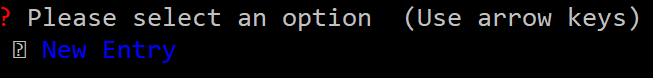
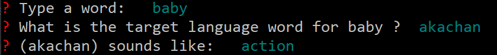
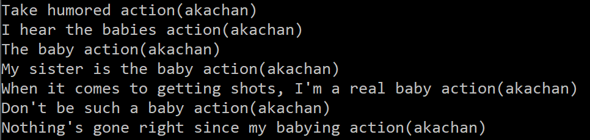

# The Language Learning Application Repository

# Overview

This is a collection of modules to assist in foreign language learning

This repository will both contain basic command line interfaces requiring minimal dependencies,
as well as more complex GUIs with more robust features that may necessitate further configuration, such as 
a running Redis server to manage database cache and queue.

# Sentence Generator

This module takes input from the user and generates a sentence based on three inputs:
- The native English spelling
- The target language spelling
- The mnemonic for the target language spelling

## Steps:

Download sentenceGenerator.py in this repository.  You will need command prompt and 
a python installation to use this program.  

Navigate to the directory
containing sentenceGenerator.py in your command prompt terminal,
and then run the following command in your console

```
python sentenceGenerator.py
```

You should see the following dialog.  As of now, there is only the "New Entry" option, so press enter to proceed.



We will then be presented with our three input questions.  For this example, 
we will use the english word "baby", the japanese translation "akachan", and the mnemonic
for "akachan" as "action":



Once typed in, the program generates the following sentences:



What this program essentially does under the hood is fetch example sentences from an online 
resource for the english word "baby", and substitutes the mnemonic "action" in those sentences
to generate a new sentence that will help the user associate between
the english word and the word in their target language. 

# Language Learner

This is the main program and requires a running Redis server.

Source files:

http://www.ashley-bovan.co.uk/words/partsofspeech.html : Parts of speech resource